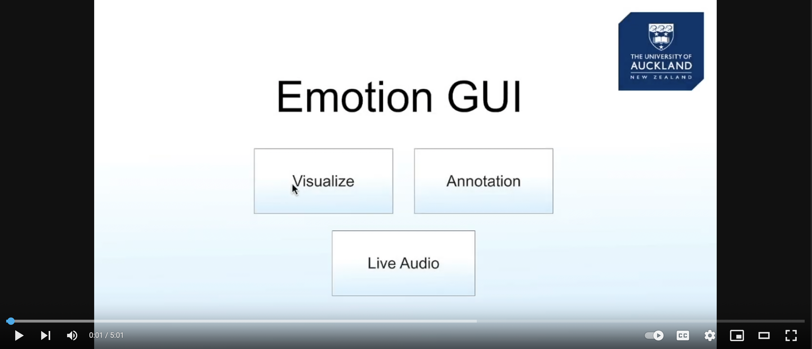
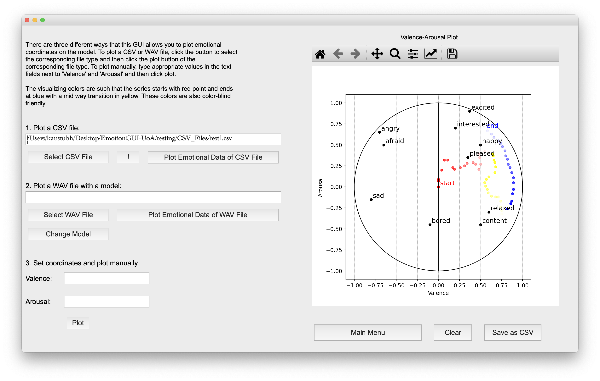
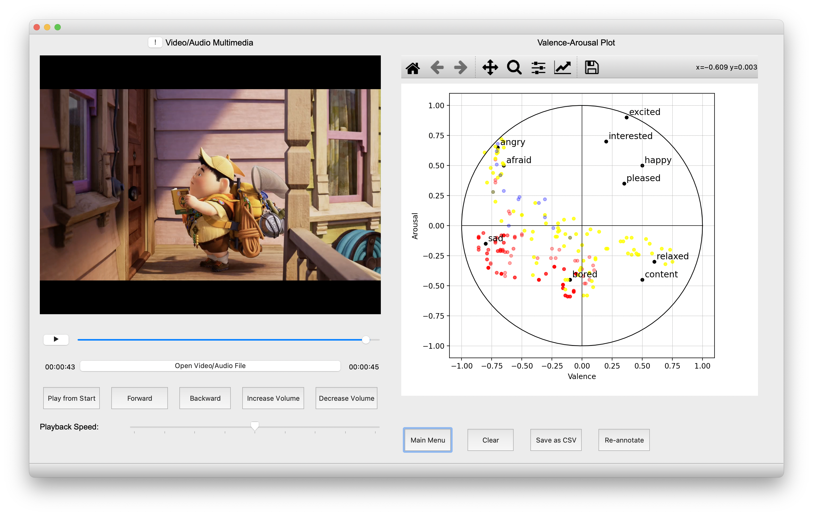
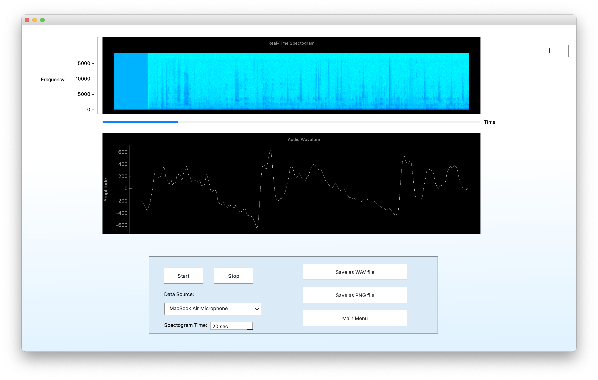

# EmotionGUI-UoA
Summer Research Project at the University of Auckland

## [Demo Video](https://youtu.be/RPXv5qq_79g)
[](https://youtu.be/RPXv5qq_79g)

## Introduction
EmotionGUI is a user-intuitive tool for the `visualization and annotation of emotions in speech and video signals`.
The tool is based on the valence-arousal two-dimensional emotion model from psychology and enables multiple users to
annotate emotions in a simple and efficient way. EmotionGUI now consists of three sections: visualize, annotate, and Live-Audio. Moreover, the tool supports multiple machine learning models that can be loaded into the tool to predict valence-arousal values and visualize them. This research aims to address the need for a user-intuitive tool that can facilitate annotation by multiple users and is open-sourced for future development. The GUI is built on top of PyQt5.

## Visualize
The visualize section allows users to see the emotions associated with a speech signal on a two-dimensional plane by inputting corresponding valence and arousal values.


## Annotation
The annotation section allowsusers to mark the valence and arousal values of the speech or video signal as a function of time.


## Live-Audio
The new Live-Audio section provides a real-time audio recording feature that can help create more quality synthetic data for different emotional training and annotation tasks.


## Installing from source
- Write `git clone https://github.com/kaustubh-s1/EmotionGUI-UoA.git` in your terminal in any directory.
- Open the folder in VS code or any other text-editor of your choice.
- Create a virtual environment by typing-
  - On mac:
    ```
    python3 -m virtualenv venv
    source venv/bin/activate
    ```

  - On Windows:
    ```
    virtualenv venv
    venv\Scripts\activate
    ```
  - On Linux:
    ```
    virtualenv venv
    virtualenv -p /usr/bin/python3 venv
    ```
After creating the virtual environment install all the dependencies by typing:-
`pip install -r requirements.txt` in the editor's terminal.
You're good to go. Open the main.py file and run it. 
Or in the editor's terminal type `python main.py`
The GUI screen will be opened and you can start now.

If in case any dependency does not get installed properly try installing it using `conda` for which you might want to install [Anaconda](https://docs.anaconda.com/anaconda/install/)

## Using the GUI with an exe (Only supported for Windows as of now)
- Download this [zip file](https://drive.google.com/file/d/1SwKJoVqbi10J9-5O1IgFFPMJ6xAztvHi/view)
- Now go to the directory `EmotionGUI-UoA/output/main/main.exe` 
- Open `main.exe` and get started


